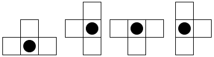
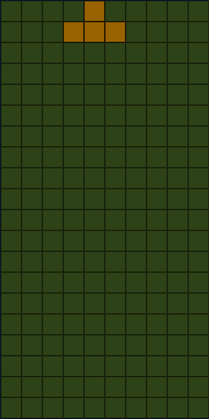
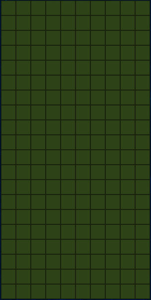
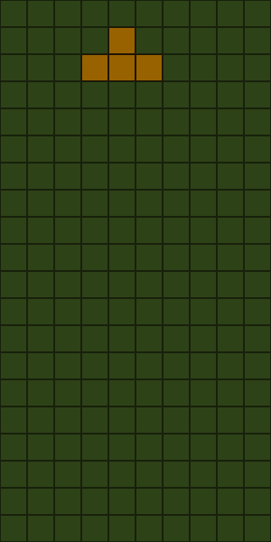
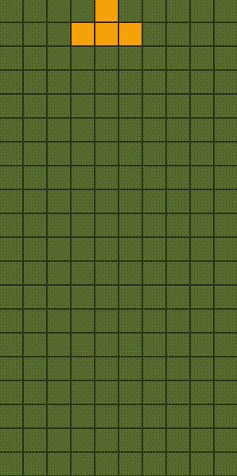

# [Tetrist](http://www.andrewjgregoryajg.com/Tetrist/)

## Background

Tetrist is a remake of the classic arcade game of Tetris. The player is presented with a board with falling blocks on it. These can be moved or rotated to form rows, which are automatically cleared to score points.

## Terminology

  * Collection: A group of `HTMLElement`s wrapped in a `DOMNodeCollection` object. A "piece" in Tetrist is merely a group of `HTMLElement`s that is manipulated as a single unit.

## Basic rules
Pieces will fall and the user can move the pieces left, right, or down and rotate the pieces clockwise/counter-clockwise. The goal is to form rows of pieces, which will then be cleared and everything to score points.

## Implementation

Tetrist was implemented with [DOMination](https://github.com/AndrewJGregory/DOMination), a lightweight DOM manipulation library and some vanilla JavaScript.

### Board Creation
The board is a container with a fixed height and width. Squares are appended to a row, then rows are appended to the board. A coordinate system is constructed as a class on the rows and the squares. This coordinate system is critical to moving the pieces in any direction. The board is constructed as such:

```
generateRows() {
  let row;
  for (var y = 19; y >= 0; y--) {
    row = this.createRow(y);
    this.generateSquares(row, y);
    this.board.append(row);
  }
}

createRow(y) {
  const row = $d.create('div').addClass('row');
  row.attr('y-pos', y);
  const position = 'row-pos' + String(y);
  row.addClass(position);
  return row;
}

generateSquares(row, y) {
  let square;
  for (let x = 0; x < 10; x++) {
    square = this.createSquare(x, y);
    row.append(square);
  }
}

createSquare(x, y) {
  const square = $d.create('div').addClass('square');
  square.attr('x-pos', x);
  square.attr('y-pos', y);
  square.attr('isPiece', false);
  const position = 'pos' + String(x) + String(y);
  square.addClass(position);
  return square;
}

```

The position is stored as a class on a square, while the x position and y position are attributes.

### Piece Creation

In Tetrist, there are seven unique shapes. Each shape has an associated ID, and any piece can exist in one of four orientations. Here are the four orientations of the T piece, with the origin designated as a black circle:



To draw a piece on the board, a starting X and Y coordinate is selected. Particular deltas are used to select the surrounding squares using the aforementioned coordinate system. Here's an example for the `shapeId` of 1, which is the T piece:

```
1: [
[[0, 0], [1, 0], [-1, 0], [0, 1]],
[[0, 0], [0, 1], [0, -1], [-1, 0]],
[[0, 0], [0, -1], [-1, 0], [1, 0]],
[[0, 0], [0, 1], [0, -1], [1, 0]]
],
```

Each of these arrays correspond exactly in order to the T pieces in the image.

To generate a piece, the squares are selected by position which is a class on every square. This is wrapped in a `DOMination` collection, which is at its core an array of `HTMLElement`s. To draw the collection on the board, the collection is finalized and given the attributes of a piece, like so:

```
const finalizePiece = (collection, shapeId) => {
  const color = generateColor(shapeId);
  collection.addClass(`${color}`)
  .addClass('moving')
  .attr('shape-id', shapeId)
  .attr('isPiece', true);
  return collection;
};
```

Now, the new collection is drawn on the board as a piece because the DOM was manipulated:



#### Piece movement

Without any user interaction, a piece moves down by itself. A simple `setInterval` is used to repeatedly remove the current collection on the board and draw the next collection. After verifying that the next collection will not collide with any other piece and will stay within the confines of the board, then the current collection is removed and the next collection is drawn. This next piece is the same exact collection with the y-coordinates of all squares shifted down one square.

The piece is removed from the board:
```
removeCurrentPiece() {
  const shapeId = this.collection.attr('shape-id');
  const color = util.generateColor(`${shapeId}`);
  this.collection.removeClass(`${color}`);
  this.collection.removeClass('moving');
  this.collection.attr('isPiece', false);
}
```

The board is then blank:



The piece is moved down by reading the `y-pos` of every square in the collection and subtracting 1, thereby moving it down. The same function that handles user input can also be used to move the piece down naturally, since a user manually moving a piece down is the same as a piece naturally 'falling' down. Here, delta would be [0, -1]:

```
const generateUserMoveCollection = (piece, delta) => {
  const collection = $d();
  let newSqPos, newSq, newYpos, newXpos, HTMLel;
  const { shapeId } = getAttributes(piece);

  for (let i = 0; i < piece.HTMLels.length; i++) {
    HTMLel = piece.HTMLels[i];
    newYpos = parseInt(HTMLel.getAttribute('y-pos')) + delta[1];
    newXpos = parseInt(HTMLel.getAttribute('x-pos')) + delta[0];
    newSqPos = String(newXpos) + String(newYpos);
    newSq = $d(`.pos${newSqPos}`);
    collection.concat(newSq);
  }

  return collection;
};
```

``newSq = $d(`.pos${newSqPos}`)`` grabs the next square by class, which is where the coordinate system is in place.

This is collection is finalized and given the attributes of a piece as before, then drawn on the board:



This process of drawing a new `Piece` on a board, removing the current collection, redrawing the collection one position down is repeated until the piece cannot move anymore. In action, this looks like:


